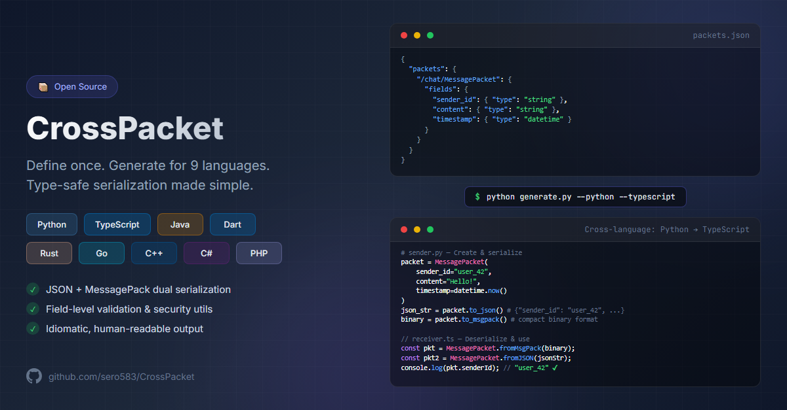

# CrossPacket

[](https://github.com/sero583/CrossPacket/actions/workflows/ci.yml)
[](https://codecov.io/gh/sero583/CrossPacket)
[](https://www.python.org/downloads/)
[](https://opensource.org/licenses/MIT)
[](https://github.com/sero583/CrossPacket/releases)

**Author:** Serhat Güler ([@sero583](https://github.com/sero583))  
**Version:** 1.0.0  
**License:** MIT

<p align="center">
  
</p>

A cross-platform data packet generator for multi-language projects. Generate type-safe packet classes from a single JSON definition.

Supports both JSON and MessagePack serialization formats.

## Supported Languages

| Language                                                                                      | Indentation | JSON Library                                    | MessagePack Library                                                            |                                                                             Coverage                                                                             |
| :-------------------------------------------------------------------------------------------- | :---------: | :---------------------------------------------- | :----------------------------------------------------------------------------- | :--------------------------------------------------------------------------------------------------------------------------------------------------------------: |
|                    |  4 spaces   | System.Text.Json (built-in)                     | [MessagePack-CSharp](https://github.com/MessagePack-CSharp/MessagePack-CSharp) |   [](https://codecov.io/gh/sero583/CrossPacket)   |
|                 |  4 spaces   | [yyjson](https://github.com/ibireme/yyjson)     | [msgpack-c](https://github.com/msgpack/msgpack-c)                              |    [](https://codecov.io/gh/sero583/CrossPacket)     |
|                    |  2 spaces   | dart:convert (built-in)                         | [msgpack_dart](https://github.com/knopp/msgpack_dart)                          |    [](https://codecov.io/gh/sero583/CrossPacket)    |
|                          |    Tabs     | encoding/json (built-in)                        | [vmihailenco/msgpack](https://github.com/vmihailenco/msgpack)                  |     [](https://codecov.io/gh/sero583/CrossPacket)     |
|                 |  4 spaces   | [Jackson](https://github.com/FasterXML/jackson) | [msgpack-java](https://github.com/msgpack/msgpack-java)                        |    [](https://codecov.io/gh/sero583/CrossPacket)    |
|                       |  4 spaces   | json (built-in)                                 | [msgpack-php](https://github.com/msgpack/msgpack-php)                          |    [](https://codecov.io/gh/sero583/CrossPacket)     |
|              |  4 spaces   | json (built-in)                                 | [msgpack-python](https://github.com/msgpack/msgpack-python)                    |   [](https://codecov.io/gh/sero583/CrossPacket)   |
|                    |  4 spaces   | [serde_json](https://github.com/serde-rs/json)  | [rmp-serde](https://github.com/3Hren/msgpack-rust)                             |    [](https://codecov.io/gh/sero583/CrossPacket)    |
|  |  2 spaces   | JSON (built-in)                                 | [@msgpack/msgpack](https://github.com/msgpack/msgpack-javascript)              | [](https://codecov.io/gh/sero583/CrossPacket) |

## Features

- JSON-based packet definitions - Define once, generate everywhere
- Dual format support - JSON for debugging, MessagePack for performance
- Deep map conversion - Safe handling of nested structures from msgpack
- Timezone-aware datetime - ISO 8601 format with timezone offset
- Documentation generation - Auto-generate doc comments from descriptions
- Idiomatic code - Follows each language's official style guidelines
- **Consistent API** - All languages support getters/setters AND parameterized constructors

## Generated API

All 9 supported languages provide a **consistent API** across packet classes:

### Constructors

| Feature                   | Description                                                                  |
| ------------------------- | ---------------------------------------------------------------------------- |
| Default constructor       | Empty constructor (Java, C++, PHP, C#) or optional parameters (Python, Dart) |
| Parameterized constructor | Constructor accepting all fields for one-line initialization                 |

### Instance Methods

| Method                         | Description                                              |
| ------------------------------ | -------------------------------------------------------- |
| `toJson()` / `to_json()`       | Serialize to JSON string (if JSON enabled)               |
| `toMsgPack()` / `to_msgpack()` | Serialize to MessagePack binary (if MsgPack enabled)     |
| Getters/Setters                | Access and modify individual fields (Java, C++, PHP, C#) |

### Static Methods

| Method                             | Description                         |
| ---------------------------------- | ----------------------------------- |
| `fromJson()` / `from_json()`       | Deserialize from JSON string        |
| `fromMsgPack()` / `from_msgpack()` | Deserialize from MessagePack binary |

### Method Naming by Language

| Language   | Serialize JSON | Serialize MsgPack | Deserialize JSON          | Deserialize MsgPack          |
| ---------- | -------------- | ----------------- | ------------------------- | ---------------------------- |
| C#         | `ToJson()`     | `ToMsgPack()`     | `FromJson()`              | `FromMsgPack()`              |
| C++        | `ToJson()`     | `ToMsgPack()`     | `FromJson()`              | `FromMsgPack()`              |
| Dart       | `toJson()`     | `toMsgPack()`     | `fromJson()`              | `fromMsgPack()`              |
| Go ¹       | `ToJSON()`     | `ToMsgPack()`     | `MessagePacketFromJSON()` | `MessagePacketFromMsgPack()` |
| Java       | `toJson()`     | `toMsgPack()`     | `fromJson()`              | `fromMsgPack()`              |
| PHP        | `toJson()`     | `toMsgPack()`     | `fromJson()`              | `fromMsgPack()`              |
| Python     | `to_json()`    | `to_msgpack()`    | `from_json()`             | `from_msgpack()`             |
| Rust       | `to_json()`    | `to_msgpack()`    | `from_json()`             | `from_msgpack()`             |
| TypeScript | `toJSON()`     | `toMsgPack()`     | `fromJSON()`              | `fromMsgPack()`              |

> ¹ **Go Note:** Deserialize functions are standalone (not methods): `MessagePacketFromJSON(data)`, `MessagePacketFromMsgPack(data)`, etc.

> See [Quick Start](#quick-start) for complete usage examples in all 9 languages.

## Installation

Clone this repository and ensure Python 3.7+ is installed:

```bash
git clone https://github.com/sero583/CrossPacket.git
cd crosspacket
```

## Quick Start

1. Define your packets in `packets.json`:

```json
{
  "packets": {
    "/chat/MessagePacket": {
      "description": "Chat message packet for communication",
      "fields": {
        "sender_id": {
          "type": "string",
          "description": "ID of the message sender"
        },
        "content": {
          "type": "string",
          "description": "Message content"
        },
        "timestamp": {
          "type": "datetime",
          "description": "When the message was sent"
        }
      }
    }
  }
}
```

2. Generate code:

```bash
# Generate all platforms
python generate.py --all

# Generate specific languages
python generate.py --dart --java --typescript

# Override existing files
python generate.py --all --override
```

3. Use the generated code (includes dependencies):

<details>
<summary><strong>C#</strong></summary>

**Dependencies:**

```bash
dotnet add package MessagePack
```

> Note: `System.Text.Json` is built-in for .NET 6+.

**Usage:**

```csharp
using System;

// === CONSTRUCTION ===

// Option 1: Object initializer (recommended)
var packet = new MessagePacket
{
    SenderId = "user123",
    Content = "Hello, world!",
    Timestamp = DateTimeOffset.Now
};

// Option 2: Parameterized constructor
var packet2 = new MessagePacket("user123", "Hello, world!", DateTimeOffset.Now);

// === SERIALIZATION ===

// To JSON (human-readable)
string json = packet.ToJson();

// To MessagePack (compact binary)
byte[] binary = packet.ToMsgPack();

// === DESERIALIZATION ===

// From JSON
var fromJson = MessagePacket.FromJson(json);
Console.WriteLine(fromJson.SenderId);  // "user123"

// From MessagePack
var fromBinary = MessagePacket.FromMsgPack(binary);
Console.WriteLine(fromBinary.Content);  // "Hello, world!"

// === ROUND-TRIP EXAMPLE ===
var original = new MessagePacket("alice", "Hi!", DateTimeOffset.Now);
byte[] binaryData = original.ToMsgPack();
var restored = MessagePacket.FromMsgPack(binaryData);
Debug.Assert(original.SenderId == restored.SenderId);
Debug.Assert(original.Content == restored.Content);
```

</details>

<details>
<summary><strong>C++</strong></summary>

**Dependencies:**

```cmake
# CMakeLists.txt
find_package(yyjson REQUIRED)
find_package(msgpack-cxx REQUIRED)
target_link_libraries(your_target yyjson msgpack-cxx)
```

Or with vcpkg:

```bash
vcpkg install yyjson msgpack
```

**Usage:**

```cpp
#include "message_packet.hpp"
#include <chrono>

// === CONSTRUCTION ===

// Option 1: Default constructor + setters
MessagePacket packet;
packet.SetSenderId("user123");
packet.SetContent("Hello, world!");
packet.SetTimestamp(std::chrono::system_clock::now());

// === SERIALIZATION ===

// To JSON (human-readable)
std::string json = packet.ToJson();

// To MessagePack (compact binary)
std::vector<uint8_t> binary = packet.ToMsgPack();

// === DESERIALIZATION ===

// From JSON
auto fromJson = MessagePacket::FromJson(json);
std::cout << fromJson.GetSenderId() << std::endl;  // "user123"

// From MessagePack
auto fromBinary = MessagePacket::FromMsgPack(binary);
std::cout << fromBinary.GetContent() << std::endl;  // "Hello, world!"

// === ROUND-TRIP EXAMPLE ===
MessagePacket original;
original.SetSenderId("alice");
original.SetContent("Hi!");
auto binaryData = original.ToMsgPack();
auto restored = MessagePacket::FromMsgPack(binaryData);
assert(original.GetSenderId() == restored.GetSenderId());
```

</details>

<details>
<summary><strong>Dart</strong></summary>

**Dependencies:**

```yaml
# pubspec.yaml
dependencies:
  msgpack_dart: ^1.0.1
```

**Usage:**

```dart
import 'dart:typed_data';
import 'message_packet.dart';

// === CONSTRUCTION ===

// Option 1: Parameterized constructor (named parameters, all optional)
final packet = MessagePacket.create(
  senderId: 'user123',
  content: 'Hello, world!',
  timestamp: DateTime.now(),
);

// Option 2: Default constructor + setters
final packet2 = MessagePacket();
packet2.senderId = 'user123';
packet2.content = 'Hello, world!';
packet2.timestamp = DateTime.now();

// === SERIALIZATION ===

// To JSON (human-readable)
String json = packet.toJson();

// To MessagePack (compact binary)
Uint8List binary = packet.toMsgPack();

// === DESERIALIZATION ===

// From JSON
final fromJson = MessagePacket.fromJson(json);
print(fromJson.content);  // 'Hello, world!'

// From MessagePack
final fromBinary = MessagePacket.fromMsgPack(binary);
print(fromBinary.timestamp);

// === ROUND-TRIP EXAMPLE ===
final original = MessagePacket.create(
  senderId: 'alice',
  content: 'Hi!',
  timestamp: DateTime.now(),
);
final binaryData = original.toMsgPack();
final restored = MessagePacket.fromMsgPack(binaryData);
assert(original.content == restored.content);
```

</details>

<details>
<summary><strong>Go</strong></summary>

**Dependencies:**

```bash
go get github.com/vmihailenco/msgpack/v5
```

**Usage:**

```go
import "time"

// === CONSTRUCTION ===

// Struct literal (Go's standard pattern)
packet := &MessagePacket{
    SenderId:  "user123",
    Content:   "Hello, world!",
    Timestamp: time.Now(),
}

// === SERIALIZATION ===

// To JSON (human-readable)
jsonBytes, err := packet.ToJSON()

// To MessagePack (compact binary)
binary, err := packet.ToMsgPack()

// === DESERIALIZATION ===

// From JSON
fromJson, err := MessagePacketFromJSON(jsonBytes)
fmt.Println(fromJson.SenderId)  // "user123"

// From MessagePack
fromBinary, err := MessagePacketFromMsgPack(binary)
fmt.Println(fromBinary.Content)  // "Hello, world!"

// === ROUND-TRIP EXAMPLE ===
original := &MessagePacket{
    SenderId:  "alice",
    Content:   "Hi!",
    Timestamp: time.Now(),
}
binaryData, _ := original.ToMsgPack()
restored, _ := MessagePacketFromMsgPack(binaryData)
// original.SenderId == restored.SenderId
```

</details>

<details>
<summary><strong>Java</strong></summary>

**Dependencies (Maven):**

```xml
<!-- pom.xml -->
<dependency>
    <groupId>org.msgpack</groupId>
    <artifactId>msgpack-core</artifactId>
    <version>0.9.11</version>
</dependency>
<dependency>
    <groupId>com.fasterxml.jackson.core</groupId>
    <artifactId>jackson-databind</artifactId>
    <version>2.15.2</version>
</dependency>
```

Or with Gradle:

```groovy
implementation 'org.msgpack:msgpack-core:0.9.11'
implementation 'com.fasterxml.jackson.core:jackson-databind:2.15.2'
```

**Usage:**

```java
import java.time.ZonedDateTime;

// === CONSTRUCTION ===

// Option 1: Parameterized constructor
MessagePacket packet = new MessagePacket(
    "user123",
    "Hello, world!",
    ZonedDateTime.now()
);

// Option 2: Default constructor + setters
MessagePacket packet2 = new MessagePacket();
packet2.setSenderId("user123");
packet2.setContent("Hello, world!");
packet2.setTimestamp(ZonedDateTime.now());

// === SERIALIZATION ===

// To JSON (human-readable)
String json = packet.toJson();

// To MessagePack (compact binary)
byte[] binary = packet.toMsgPack();

// === DESERIALIZATION ===

// From JSON
MessagePacket fromJson = MessagePacket.fromJson(json);
System.out.println(fromJson.getSenderId());  // "user123"

// From MessagePack
MessagePacket fromBinary = MessagePacket.fromMsgPack(binary);
System.out.println(fromBinary.getContent());  // "Hello, world!"

// === ROUND-TRIP EXAMPLE ===
MessagePacket original = new MessagePacket("alice", "Hi!", ZonedDateTime.now());
byte[] binaryData = original.toMsgPack();
MessagePacket restored = MessagePacket.fromMsgPack(binaryData);
assert original.getSenderId().equals(restored.getSenderId());
assert original.getContent().equals(restored.getContent());
```

</details>

<details>
<summary><strong>PHP</strong></summary>

**Dependencies:**

```bash
# Install msgpack extension
pecl install msgpack

# Add to php.ini
extension=msgpack.so
```

Or with composer (for polyfill):

```bash
composer require rybakit/msgpack
```

**Usage:**

```php
<?php
use App\DataPackets\MessagePacket;

// === CONSTRUCTION ===

// Option 1: Parameterized constructor
$packet = new MessagePacket(
    'user123',
    'Hello, world!',
    new DateTimeImmutable()
);

// Option 2: Default constructor + setters
$packet2 = new MessagePacket();
$packet2->setSenderId('user123');
$packet2->setContent('Hello, world!');
$packet2->setTimestamp(new DateTimeImmutable());

// === SERIALIZATION ===

// To JSON (human-readable)
$json = $packet->toJson();

// To MessagePack (compact binary)
$binary = $packet->toMsgPack();

// === DESERIALIZATION ===

// From JSON
$fromJson = MessagePacket::fromJson($json);
echo $fromJson->getSenderId();  // 'user123'

// From MessagePack
$fromBinary = MessagePacket::fromMsgPack($binary);
echo $fromBinary->getContent();  // 'Hello, world!'

// === ROUND-TRIP EXAMPLE ===
$original = new MessagePacket('alice', 'Hi!', new DateTimeImmutable());
$binaryData = $original->toMsgPack();
$restored = MessagePacket::fromMsgPack($binaryData);
assert($original->getSenderId() === $restored->getSenderId());
assert($original->getContent() === $restored->getContent());
```

</details>

<details>
<summary><strong>Python</strong></summary>

**Dependencies:**

```bash
pip install msgpack
```

**Usage:**

```python
from datetime import datetime, timezone
from message_packet import MessagePacket

# === CONSTRUCTION ===

# Option 1: Parameterized constructor (all params optional with None defaults)
packet = MessagePacket(
    sender_id='user123',
    content='Hello, world!',
    timestamp=datetime.now(timezone.utc),
)

# Option 2: Default constructor + setters
packet = MessagePacket()
packet.sender_id = 'user123'
packet.content = 'Hello, world!'
packet.timestamp = datetime.now(timezone.utc)

# === SERIALIZATION ===

# To JSON (human-readable, for debugging/logging)
json_str: str = packet.to_json()
# '{"packetType": "/chat/MessagePacket", "sender_id": "user123", "content": "Hello, world!", ...}'

# To MessagePack (compact binary, for network transmission)
binary: bytes = packet.to_msgpack()

# === DESERIALIZATION ===

# From JSON
received = MessagePacket.from_json(json_str)
print(received.content)  # 'Hello, world!'

# From MessagePack
received = MessagePacket.from_msgpack(binary)
print(received.timestamp)  # datetime object

# === ROUND-TRIP EXAMPLE ===
original = MessagePacket(sender_id='alice', content='Hi!', timestamp=datetime.now(timezone.utc))
binary_data = original.to_msgpack()
restored = MessagePacket.from_msgpack(binary_data)
assert original.content == restored.content
```

</details>

<details>
<summary><strong>Rust</strong></summary>

**Dependencies:**

```toml
# Cargo.toml
[dependencies]
serde = { version = "1.0", features = ["derive"] }
serde_json = "1.0"
rmp-serde = "1.3"
chrono = { version = "0.4", features = ["serde"] }
```

**Usage:**

```rust
use chrono::Utc;

// === CONSTRUCTION ===

// Struct initialization (Rust's standard pattern)
let packet = MessagePacket {
    sender_id: "user123".to_string(),
    content: "Hello, world!".to_string(),
    timestamp: Utc::now(),
};

// === SERIALIZATION ===

// To JSON (human-readable)
let json: String = packet.to_json()?;

// To MessagePack (compact binary)
let binary: Vec<u8> = packet.to_msgpack()?;

// === DESERIALIZATION ===

// From JSON
let from_json = MessagePacket::from_json(&json)?;
println!("{}", from_json.sender_id);  // "user123"

// From MessagePack
let from_binary = MessagePacket::from_msgpack(&binary)?;
println!("{}", from_binary.content);  // "Hello, world!"

// === ROUND-TRIP EXAMPLE ===
let original = MessagePacket {
    sender_id: "alice".to_string(),
    content: "Hi!".to_string(),
    timestamp: Utc::now(),
};
let binary_data = original.to_msgpack()?;
let restored = MessagePacket::from_msgpack(&binary_data)?;
assert_eq!(original.sender_id, restored.sender_id);
assert_eq!(original.content, restored.content);
```

</details>

<details>
<summary><strong>TypeScript</strong></summary>

**Dependencies:**

```bash
npm install @msgpack/msgpack
```

**Usage:**

```typescript
import { MessagePacket } from "./message_packet";

// === CONSTRUCTION ===

// Option 1: Object initializer (recommended)
const packet = new MessagePacket({
  senderId: "user123",
  content: "Hello, world!",
  timestamp: new Date(),
});

// Option 2: Empty constructor + property assignment
const packet2 = new MessagePacket({});
packet2.senderId = "user123";
packet2.content = "Hello, world!";
packet2.timestamp = new Date();

// === SERIALIZATION ===

// To JSON (returns string)
const json: string = packet.toJSON();

// To MessagePack (compact binary)
const binary: Uint8Array = packet.toMsgPack();

// === DESERIALIZATION ===

// From JSON (accepts string)
const fromJson = MessagePacket.fromJSON(json);
console.log(fromJson.senderId); // 'user123'

// From MessagePack
const fromBinary = MessagePacket.fromMsgPack(binary);
console.log(fromBinary.content); // 'Hello, world!'

// === ROUND-TRIP EXAMPLE ===
const original = new MessagePacket({
  senderId: "alice",
  content: "Hi!",
  timestamp: new Date(),
});
const binaryData = original.toMsgPack();
const restored = MessagePacket.fromMsgPack(binaryData);
console.assert(original.senderId === restored.senderId);
```

</details>

> **Note:** Both serialization formats are **optional**. Use `--no-msgpack` for JSON-only code or `--no-json` for MessagePack-only code.

## Error Handling

All generated packets throw exceptions when deserialization fails. Here's how to handle errors in each language:

<details>
<summary><strong>C#</strong></summary>

```csharp
try {
    var packet = MessagePacket.FromJson(invalidJson);
} catch (JsonException ex) {
    Console.WriteLine($"JSON parse error: {ex.Message}");
} catch (MessagePackSerializationException ex) {
    Console.WriteLine($"MsgPack error: {ex.Message}");
}
```

</details>

<details>
<summary><strong>C++</strong></summary>

```cpp
try {
    auto packet = MessagePacket::FromJson(invalidJson);
} catch (const std::runtime_error& e) {
    std::cerr << "Parse error: " << e.what() << std::endl;
}
```

</details>

<details>
<summary><strong>Dart</strong></summary>

```dart
try {
  final packet = MessagePacket.fromJson(invalidJson);
} on FormatException catch (e) {
  print('JSON parse error: ${e.message}');
}
```

</details>

<details>
<summary><strong>Go</strong></summary>

```go
packet, err := MessagePacketFromJSON(invalidJson)
if err != nil {
    log.Printf("Parse error: %v", err)
    return
}
```

</details>

<details>
<summary><strong>Java</strong></summary>

```java
try {
    MessagePacket packet = MessagePacket.fromJson(invalidJson);
} catch (JsonProcessingException e) {
    System.err.println("JSON parse error: " + e.getMessage());
} catch (IOException e) {
    System.err.println("MsgPack error: " + e.getMessage());
}
```

</details>

<details>
<summary><strong>PHP</strong></summary>

```php
try {
    $packet = MessagePacket::fromJson($invalidJson);
} catch (JsonException $e) {
    echo "JSON parse error: " . $e->getMessage();
}
```

</details>

<details>
<summary><strong>Python</strong></summary>

```python
try:
    packet = MessagePacket.from_json(invalid_json)
except json.JSONDecodeError as e:
    print(f"JSON parse error: {e}")
except Exception as e:
    print(f"Deserialization error: {e}")
```

</details>

<details>
<summary><strong>Rust</strong></summary>

```rust
match MessagePacket::from_json(&invalid_json) {
    Ok(packet) => println!("Parsed: {:?}", packet),
    Err(e) => eprintln!("Parse error: {}", e),
}

// Or with ? operator
let packet = MessagePacket::from_json(&json)?;
```

</details>

<details>
<summary><strong>TypeScript</strong></summary>

```typescript
try {
  const packet = MessagePacket.fromJSON(invalidJson);
} catch (error) {
  console.error("Parse error:", error instanceof Error ? error.message : error);
}
```

</details>

## Packet Definition Reference

### Configuration

#### Global Settings

```json
{
  "config": {
    "global": {
      "strict_validation": true,
      "generate_security_utils": true,
      "schema_version": "1.0.0",
      "type_field": "packetType",
      "serialization": {
        "json": true,
        "msgpack": true
      }
    }
  }
}
```

The `serialization` setting controls which serialization formats are generated:

| Setting                   | Effect                                                           |
| ------------------------- | ---------------------------------------------------------------- |
| `json: true` (default)    | Generate JSON serialization methods                              |
| `json: false`             | Omit JSON methods (equivalent to `--no-json` CLI flag)           |
| `msgpack: true` (default) | Generate MessagePack serialization methods                       |
| `msgpack: false`          | Omit MessagePack methods (equivalent to `--no-msgpack` CLI flag) |

> **Note:** CLI flags (`--no-json`, `--no-msgpack`) take precedence over config file settings.

#### Type Field Configuration

The `type_field` setting controls the name of the field used to identify packet types in serialized data:

```json
{
  "config": {
    "global": {
      "type_field": "packetType"
    }
  }
}
```

| Setting                              | Effect                                                        |
| ------------------------------------ | ------------------------------------------------------------- |
| `type_field: "packetType"` (default) | Serialized packets include `"packetType": "/path/PacketName"` |
| `type_field: "customName"`           | Use custom field name for type identification                 |

> **⚠️ Important:** The configured `type_field` name is **reserved** and cannot be used as a field name in any packet definition. The generator will exit with an error if you attempt to use a reserved field name.
>
> **Example:** With default settings (`type_field: "packetType"`), you cannot create a field named `packetType`. If you need a field called `type`, you can safely use it since `type` is not the reserved name.

This is useful when:

- Your application already uses `type` for other purposes
- You want a more descriptive field name like `messageType` or `eventKind`
- You need to match an existing protocol's naming convention

#### Language-Specific Settings

```json
{
  "config": {
    "dart": {
      "output_dir": "./output/dart",
      "base_package": "your_package"
    },
    "java": {
      "output_dir": "./output/java",
      "package": "com.example.packets"
    },
    "typescript": {
      "output_dir": "./output/typescript"
    },
    "rust": {
      "output_dir": "./output/rust"
    },
    "go": {
      "output_dir": "./output/go",
      "package": "packets"
    },
    "python": {
      "output_dir": "./output/python"
    },
    "cpp": {
      "output_dir": "./output/cpp",
      "namespace": "packets"
    },
    "csharp": {
      "output_dir": "./output/csharp",
      "namespace": "CrossPacket.Packets"
    },
    "php": {
      "output_dir": "./output/php",
      "namespace": "App\\DataPackets"
    }
  }
}
```

### Supported Types

| Type                 | Dart                    | Java                  | TypeScript            | Rust                     | Go                       | Python           | C++                  | C#                            | PHP                 |
| -------------------- | ----------------------- | --------------------- | --------------------- | ------------------------ | ------------------------ | ---------------- | -------------------- | ----------------------------- | ------------------- |
| `int`                | `int`                   | `long`                | `number`              | `i64`                    | `int64`                  | `int`            | `int64_t`            | `long`                        | `int`               |
| `float`              | `double`                | `double`              | `number`              | `f64`                    | `float64`                | `float`          | `double`             | `double`                      | `float`             |
| `double`             | `double`                | `double`              | `number`              | `f64`                    | `float64`                | `float`          | `double`             | `double`                      | `float`             |
| `bool`               | `bool`                  | `boolean`             | `boolean`             | `bool`                   | `bool`                   | `bool`           | `bool`               | `bool`                        | `bool`              |
| `string`             | `String`                | `String`              | `string`              | `String`                 | `string`                 | `str`            | `std::string`        | `string`                      | `string`            |
| `datetime`           | `DateTime`              | `ZonedDateTime`       | `Date`                | `DateTime<Utc>`          | `time.Time`              | `datetime`       | `std::string`        | `DateTimeOffset`              | `DateTimeImmutable` |
| `time`               | `Duration`              | `LocalTime`           | `string`              | `String`                 | `string`                 | `time`           | `std::string`        | `TimeSpan`                    | `string`            |
| `bytes`              | `Uint8List`             | `byte[]`              | `Uint8Array`          | `Vec<u8>`                | `[]byte`                 | `bytes`          | `vector<uint8_t>`    | `byte[]`                      | `string`            |
| `list`               | `List<dynamic>`         | `List<Object>`        | `any[]`               | `Vec<Value>`             | `[]interface{}`          | `List[Any]`      | `std::string` (JSON) | `List<object>`                | `array`             |
| `list_int`           | `List<int>`             | `List<Long>`          | `number[]`            | `Vec<i64>`               | `[]int64`                | `List[int]`      | `vector<int64_t>`    | `List<long>`                  | `array`             |
| `list_string`        | `List<String>`          | `List<String>`        | `string[]`            | `Vec<String>`            | `[]string`               | `List[str]`      | `vector<string>`     | `List<string>`                | `array`             |
| `map`                | `Map<String, dynamic>`  | `Map<String, Object>` | `Record<string, any>` | `HashMap`                | `map[string]interface{}` | `Dict[str, Any]` | `std::string` (JSON) | `Dictionary<string, object>`  | `array`             |
| `embedded_map`       | `Map<dynamic, dynamic>` | `Map<Object, Object>` | `Map<any, any>`       | `HashMap`                | `map[string]interface{}` | `Dict[Any, Any]` | `std::string` (JSON) | `Dictionary<string, object>`  | `array`             |
| `map_string_dynamic` | `Map<String, dynamic>`  | `Map<String, Object>` | `Record<string, any>` | `HashMap<String, Value>` | `map[string]interface{}` | `Dict[str, Any]` | `std::string` (JSON) | `Dictionary<string, object?>` | `array`             |

> **Note:** For `embedded_map` in C#, keys are converted to strings for JSON compatibility. MsgPack supports any key type.

### Field Options

```json
{
  "fields": {
    "required_field": {
      "type": "string",
      "description": "This field is required"
    },
    "optional_field": {
      "type": "int",
      "description": "This field is optional",
      "optional": true
    }
  }
}
```

### Field-Level Validation

CrossPacket supports granular field-level validation that can override global settings. This enables fine-tuned control for security-critical applications.

#### Global Validation Settings

Define global validation limits in the config section:

```json
{
  "config": {
    "global": {
      "strict_validation": true,
      "generate_security_utils": true,
      "schema_version": "1.0.0"
    },
    "validation": {
      "max_int": 9007199254740991,
      "min_int": -9007199254740991,
      "max_list_size": 100000,
      "max_map_size": 100000,
      "max_string_length": 10000000,
      "max_bytes_length": 104857600
    }
  }
}
```

#### Per-Field Validation Overrides

Override global settings for individual fields:

```json
{
  "packets": {
    "/user/ProfilePacket": {
      "description": "User profile with strict validation",
      "fields": {
        "username": {
          "type": "string",
          "description": "Unique username",
          "validation": {
            "required": true,
            "min": 3,
            "max": 50,
            "pattern": "^[a-zA-Z0-9_]+$",
            "allow_empty": false
          }
        },
        "age": {
          "type": "int",
          "description": "User age",
          "validation": {
            "required": true,
            "min": 0,
            "max": 150
          }
        },
        "balance": {
          "type": "float",
          "description": "Account balance",
          "validation": {
            "required": true,
            "min": 0.0,
            "max": 1000000.0,
            "allow_nan": false,
            "allow_infinity": false
          }
        },
        "friends_list": {
          "type": "list_string",
          "description": "List of friend IDs",
          "validation": {
            "max": 1000
          }
        },
        "nested_data": {
          "type": "map",
          "description": "Nested configuration",
          "validation": {
            "max_depth": 3
          }
        }
      }
    }
  }
}
```

#### Validation Properties Reference

| Property         | Applies To                      | Description                              |
| ---------------- | ------------------------------- | ---------------------------------------- |
| `required`       | All types                       | Field must be present (default: `false`) |
| `min`            | int, float, string, list, bytes | Minimum value or length                  |
| `max`            | int, float, string, list, bytes | Maximum value or length                  |
| `pattern`        | string                          | Regex pattern for validation             |
| `allow_empty`    | string                          | Allow empty strings (default: `true`)    |
| `allow_nan`      | float, double                   | Allow NaN values (default: `true`)       |
| `allow_infinity` | float, double                   | Allow Infinity values (default: `true`)  |
| `max_depth`      | map, embedded_map               | Maximum nesting depth                    |

#### Example: Secure Message Packet

For high-security applications:

> **⚠️ Security Note:** This example demonstrates how to structure a packet that _contains_ encrypted data and cryptographic fields. **CrossPacket does not implement encryption** — it only handles serialization. You must implement the actual encryption/decryption, key management, and HMAC verification in your application code using appropriate cryptographic libraries (e.g., OpenSSL, libsodium, BouncyCastle).

```json
{
  "/secure/MessagePacket": {
    "description": "Security-hardened message packet",
    "version": "2.1.0",
    "fields": {
      "message_id": {
        "type": "string",
        "description": "Unique message identifier (UUID v4)",
        "validation": {
          "required": true,
          "min": 36,
          "max": 36,
          "pattern": "^[0-9a-f]{8}-[0-9a-f]{4}-4[0-9a-f]{3}-[89ab][0-9a-f]{3}-[0-9a-f]{12}$"
        }
      },
      "encryption_key": {
        "type": "bytes",
        "description": "256-bit AES key",
        "validation": {
          "required": true,
          "min": 32,
          "max": 32
        }
      },
      "payload": {
        "type": "bytes",
        "description": "Encrypted payload",
        "validation": {
          "required": true,
          "max": 1048576
        }
      },
      "timestamp": {
        "type": "datetime",
        "description": "Message timestamp",
        "validation": {
          "required": true
        }
      },
      "hmac_signature": {
        "type": "bytes",
        "description": "HMAC-SHA256 signature",
        "validation": {
          "required": true,
          "min": 32,
          "max": 32
        }
      }
    }
  }
}
```

### Packet Versioning

Add version information to packets for API compatibility:

```json
{
  "/api/UserPacket": {
    "description": "User data packet",
    "version": "2.0.0",
    "deprecated": false,
    "fields": { ... }
  }
}
```

The `version` field follows semantic versioning and is embedded in generated code comments. Set `deprecated: true` to mark packets that should be phased out.

## Why MessagePack?

MessagePack is a binary serialization format that provides:

- Smaller payloads - More compact than JSON (actual savings vary by data structure)
- Faster parsing - Binary parsing outperforms text parsing
- Type-rich - Native support for binary data, maps, arrays
- Cross-platform - Libraries available for all major languages

Ideal for:

- WebSocket communication
- Real-time applications
- Mobile apps with bandwidth constraints
- High-performance servers

## Security Features

CrossPacket includes optional security utilities for hardening generated packets in security-critical applications.

### Security Utilities

The generated code includes security utility modules for Python and C#:

**Python (`output/python/security_utils.py`):**

```python
from security_utils import (
    ValidationError,
    SecurityLimits,
    validate_int,
    validate_string,
    validate_list,
    validate_map,
    validate_required_fields,
)

# Configure custom limits for your application
limits = SecurityLimits(
    max_int=2**31,  # 32-bit range
    max_list_size=10000,
    max_map_size=10000,
    max_string_length=1000000,
)

# Validate incoming data before creating packets
try:
    validate_required_fields(data, ["user_id", "amount", "timestamp"], "TransactionPacket")
    user_id = validate_string(data["user_id"], "user_id", limits, min_length=1)
    amount = validate_int(data["amount"], "amount", limits)
    items = validate_list(data["items"], "items", limits)
except ValidationError as e:
    logger.error(f"Validation failed: {e.field} - {e.message}")
    raise
```

**C# (`output/csharp/SecurityUtils.cs`):**

```csharp
using CrossPacket;

// Use strict limits for high-security applications
var limits = SecurityLimits.Strict;

try
{
    PacketValidator.ValidateRequiredFields(data, new[] { "user_id", "amount" }, "TransactionPacket");
    var userId = PacketValidator.ValidateString(data["user_id"], "user_id", limits, minLength: 1);
    var amount = PacketValidator.ValidateInt(data["amount"], "amount", limits);
    var items = PacketValidator.ValidateList<object>(data["items"], "items", limits);
}
catch (ValidationException ex)
{
    logger.Error($"Validation failed: {ex.FieldName} - {ex.Message}");
    throw;
}
```

### Includes:

| Feature             | Description                                            |
| ------------------- | ------------------------------------------------------ |
| **Bounds Checking** | Integer overflow/underflow detection                   |
| **Size Limits**     | Configurable max sizes for lists, maps, strings, bytes |
| **Required Fields** | Explicit validation of mandatory fields                |
| **Type Validation** | Strict type checking (no implicit coercion)            |
| **NaN/Infinity**    | Float validation with configurable handling            |
| **Error Context**   | Detailed error messages with field names and values    |

### Security Recommendations for Critical Applications

1. **Always validate untrusted input** using the security utilities before creating packets
2. **Set appropriate limits** based on your application's needs
3. **Log validation failures** for security monitoring
4. **Consider HMAC signing** for packet integrity (implement as wrapper)
5. **Use schema versioning** for backward/forward compatibility

## Command Line Options

```
usage: generate.py [-h] [--config CONFIG] [--dart] [--python] [--java]
                   [--typescript] [--rust] [--go] [--cpp] [--csharp] [--php] [--all]
                   [--override] [--clean] [--no-msgpack] [--no-json] [--version]

Options:
  --config FILE    Path to packets.json (default: ./packets.json)
  --dart           Generate Dart code
  --python         Generate Python code
  --java           Generate Java code
  --typescript     Generate TypeScript code
  --rust           Generate Rust code
  --go             Generate Go code
  --cpp            Generate C++ code
  --csharp         Generate C# code
  --php            Generate PHP code
  --all            Generate all platforms
  --override       Override existing files
  --clean          Remove old generated files first
  --no-msgpack     Generate JSON-only code (no MessagePack dependency)
  --no-json        Generate MessagePack-only code (no JSON dependency)
  --version        Show version
```

## Running Tests

All 9 supported languages have comprehensive test suites in their respective `tests/{language}/` folders.

### Quick Test Commands

```bash
# Python (pytest)
python -m pytest tests/ -v

# Dart
cd tests/dart && dart run test_comprehensive.dart

# Go
cd tests/go && go run test_comprehensive.go

# TypeScript
cd tests/typescript && npx ts-node test_comprehensive.ts

# Rust
cd tests/rust && cargo run

# Java (via Maven)
cd tests/java && mvn compile exec:java

# C# (.NET 9)
cd tests/csharp && dotnet run

# PHP
php tests/php/test_comprehensive.php
```

### Test Coverage

| Category | Test Cases                                                               |
| -------- | ------------------------------------------------------------------------ |
| Integers | 0, 1, -1, INT_MAX, INT_MIN, powers of 2, Fibonacci, primes               |
| Floats   | Zero, precision (pi, euler, golden ratio), scientific notation           |
| Strings  | Empty, whitespace, escape sequences, URLs, paths, JSON/XML/HTML embedded |
| Lists    | Empty, nested 2D/3D, irregular, 10-level deep, mixed types, sparse       |
| Maps     | Empty, nested 4 levels, arrays in maps, special keys, null values        |
| Complex  | User profiles, API responses, graph/tree structures, config files        |

### Pytest Suite

```bash
python -m pytest tests/ -v
```

## Project Structure

```
crosspacket/
├── generate.py              # Main generator
├── packets.json             # Packet definitions
├── packets.schema.json      # JSON Schema validation
├── tests/
│   ├── test_generator.py    # Generator unit tests
│   ├── test_serialization.py # Serialization tests
│   ├── test_data.json       # Shared test data
│   ├── python/              # Python tests
│   ├── dart/                # Dart tests
│   ├── typescript/          # TypeScript tests
│   ├── java/                # Java tests (Maven)
│   ├── go/                  # Go tests
│   ├── rust/                # Rust tests (Cargo)
│   ├── csharp/              # C# tests (.NET)
│   ├── cpp/                 # C++ tests
│   └── php/                 # PHP tests
└── output/                  # Generated code (gitignored)
```

## Contributing

See [CONTRIBUTING.md](CONTRIBUTING.md) for guidelines.

## Testing

CrossPacket has comprehensive test coverage across all 9 languages. See [TESTING.md](TESTING.md) for:

- Test suite documentation for each language
- Coverage targets and current status
- How to run tests locally
- Edge cases and error handling coverage

## Changelog

### v1.0.0 (2026-01-09)

**Core Features:**

- Cross-platform data packet generator supporting 9 languages
- JSON and MessagePack dual serialization formats
- Field-level validation with configurable strictness
- Security utilities for Python and C#

**Supported Languages:**

- C#, C++, Dart, Go, Java, PHP, Python, Rust, TypeScript

**Testing & Coverage:**

- Comprehensive test suites for all 9 languages
- Integrated Codecov for dynamic coverage tracking
- CI workflows for automated testing across all languages

**Generator Features:**

- Configurable `type_field` for packet type identification
- Proper handling of all field types including bytes, maps, and nested structures
- Idiomatic code generation following each language's style guide

## License

MIT License - see [LICENSE](LICENSE) for details.
